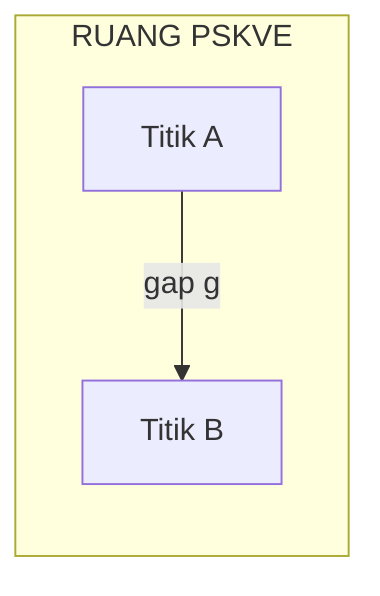
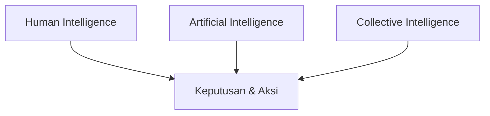
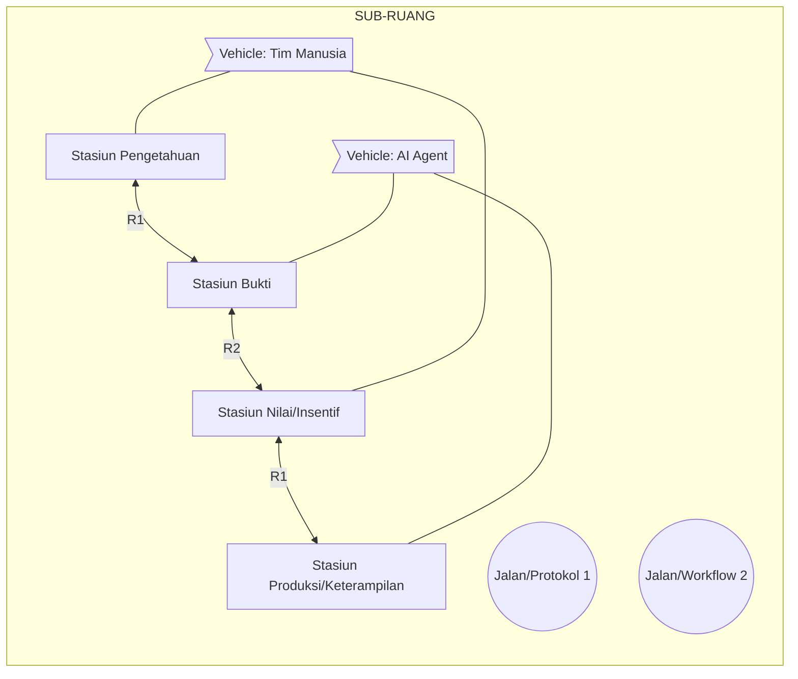
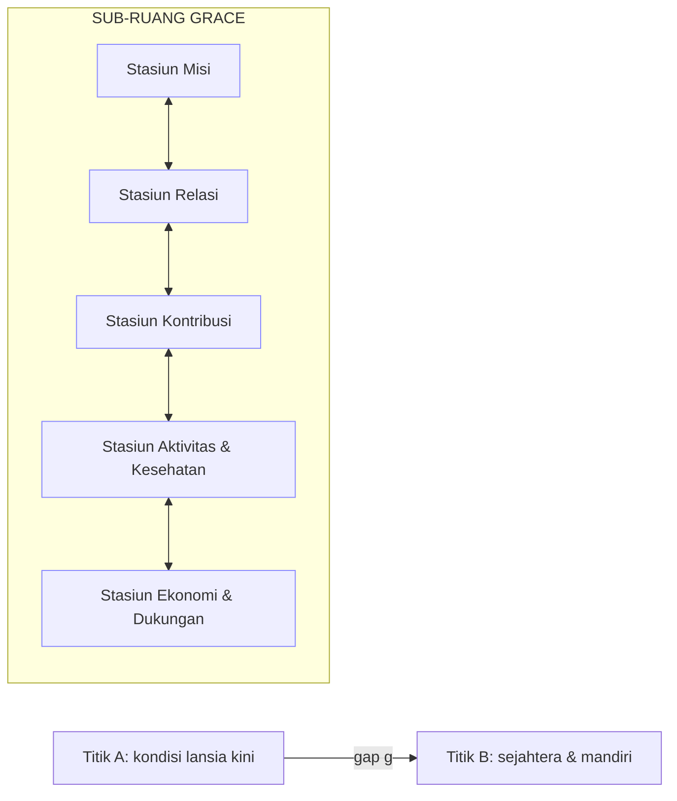
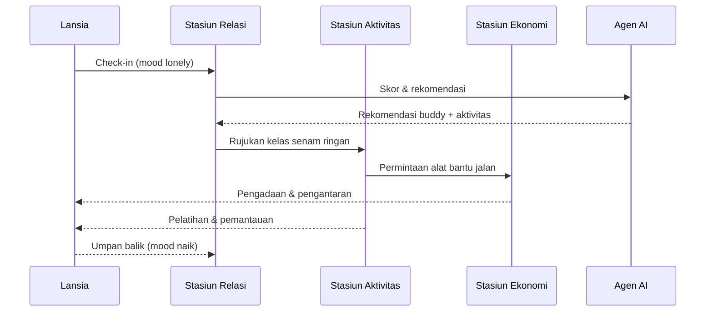
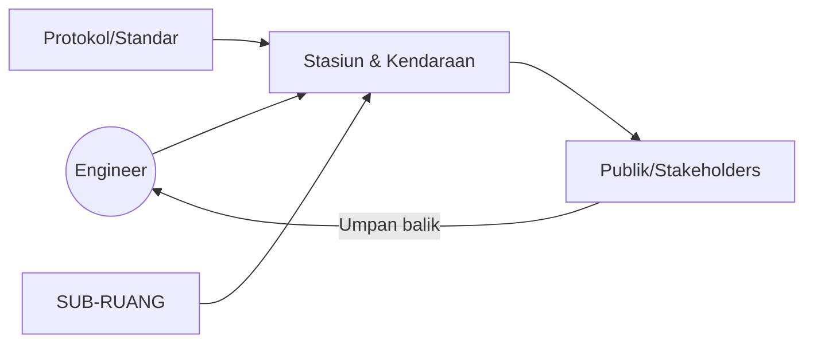

# Paradigma Triune‑Intelligence Smart Engineering (TISE)

**Subjudul:** Orkestra PSKVE untuk Menutup Gap dari Titik A ke Titik B

**Penulis:** <isi nama penulis>  
**Versi:** draf v0.1  
**Catatan:** PSKVE merujuk pada lima dimensi (P, S, K, V, E) sesuai definisi Anda; buku ini menggunakan notasi tersebut tanpa menetapkan penamaan baku agar kompatibel dengan berbagai domain.

---

## Kata Pengantar
Kita hidup di era di mana kebutuhan bernilai tinggi makin kompleks, sementara kapasitas individu sering tak mencukupi untuk mencapainya sendirian. **TISE (Triune‑Intelligence Smart Engineering)** menawarkan paradigma rekayasa cerdas yang mengorkestrasi **NI (Natural/Human Intelligence)**, **AI (Artificial Intelligence)**, dan **CI (Collective Intelligence)** di dalam **SUB‑RUANG** pada **RUANG PSKVE** untuk menutup **gap** dari **Titik A (keadaan kini)** ke **Titik B (keadaan target)** secara efektif, etis, terukur, dan berkelanjutan.

Paradigma ini memetakan masalah sebagai sebuah **gap** di ruang multi‑dimensi PSKVE, lalu membangun **lingkungan kerja** yang terdiri dari **stasiun, jalan, dan kendaraan** yang berperan sebagai **agen cerdas** bersiklus **PUDAL** (Perception, Understanding, Decision, Action, Learning). Setiap agen digerakkan oleh **CORE ENGINE** yang mengonversi **energon** (satuan sumber‑daya) menjadi **work** (usaha nyata) melalui siklus **input → encode → decode → output**.

Buku ini menyajikan landasan, arsitektur, pola orkestrasi, tata kelola, hingga implementasi dan studi kasus. Sasaran pembaca meliputi praktisi, peneliti, pendidik, pemimpin organisasi, dan pembuat kebijakan.

---

## Cara Menggunakan Buku Ini
- **Jalur Praktisi:** Baca Bagian I–III, lalu Bagian V–VI untuk pola orkestrasi, tooling, dan studi kasus.
- **Jalur Peneliti:** Dalami Bagian II & VII mengenai CORE ENGINE, konversi energon, metodologi eksperimen, dan standar publikasi.
- **Jalur Pendidik:** Gunakan kerangka PSKVE & PUDAL untuk merancang tugas, rubrik, dan *learning analytics*. Lihat Lampiran C.

Setiap bab dilengkapi **Ringkasan**, **Tujuan Pembelajaran**, **Pertanyaan Pemandu**, **Peta Konsep**, **Latihan**, dan **Kartu Aksi**.

---

## Notasi Inti
- **PSKVE**: Vektor keadaan \( s,t \in \mathbb{R}^5 \) → **gap** \( g=t-s \).
- **SUB‑RUANG**: Subset operasional dalam RUANG PSKVE tempat pertukaran & transformasi PSKVE.
- **Agen Cerdas**: Stasiun/Jalan/Kendaraan ber‑PUDAL.
- **Energon**: Satuan sumber‑daya (data, waktu, perhatian, dana, material, kepercayaan, kompetensi, dll.).
- **CORE ENGINE**: Mesin konversi energon → work.

---

# BAGIAN I — LANDASAN TISE

## Bab 1. Narasi Masalah & Ruang PSKVE
**Ringkasan.** Masalah direpresentasikan sebagai **gap** antara kondisi sekarang (A) dan target (B) di RUANG PSKVE. Tujuan rekayasa: menutup gap dengan memaksimalkan nilai multipihak dan keberlanjutan.

**Tujuan Pembelajaran**
1. Memetakan masalah ke vektor PSKVE.
2. Mendefinisikan target dan metrik gap.
3. Mengidentifikasi stakeholders dan kebutuhannya.

**Peta Konsep**


**Konten Utama**
- **Model Keadaan**: \( s=(p,s,k,v,e) \), \( t=(p^*,s^*,k^*,v^*,e^*) \), gap \( g=t-s \).
- **Kriteria Keberhasilan**: *gap‑closure rate*, kepuasan stakeholder, efisiensi energon, dan indeks keberlanjutan.
- **Masalah sebagai Orkestrasi**: Bukan sekadar optimasi lokal, melainkan koordinasi lintas agen & dimensi PSKVE.

**Kartu Aksi**
- Definisikan A dan B dalam 5 dimensi PSKVE.
- Pilih 3 metrik paling relevan untuk diukur mingguan.

**Latihan**
1) Petakan proyek Anda ke vektor PSKVE (5 angka bernorma 0–1). 2) Hitung besaran \(\|g\|\) dan diskusikan implikasi prioritas.

---

## Bab 2. Triune‑Intelligence (NI × AI × CI)
**Ringkasan.** Keunggulan TISE terletak pada kopling **Natural/Human Intelligence (NI)**, **Artificial Intelligence (AI)**, dan **Collective Intelligence (CI)**. Ketiganya membentuk *loop* saling menguatkan.

**Tujuan Pembelajaran**
1. Merancang peran NI–AI–CI pada proses PSKVE.
2. Menentukan batas kewenangan dan eskalasi keputusan.
3. Mendesain mekanisme umpan balik untuk CI.

**Konten Utama**
- **NI**: makna, etika, empati, intuisi, *tacit knowledge*.
- **AI**: persepsi otomatis, pemodelan, optimasi, kopilot eksekusi.
- **CI**: konsensus, tata‑kelola, *peer review*, pasar internal, komunitas.
- **Arsitektur Keputusan**: keputusan penting = NI × AI × CI → akurasi + akuntabilitas + kecepatan.

**Peta Peran**


**Kartu Aksi**
- Buat matriks RACI untuk keputusan inti: kolom = {NI, AI, CI}, baris = keputusan.

**Latihan**
- Rancang mekanisme *disagreement handling* antara NI dan AI; kapan CI menjadi arbitrase?

---

## Bab 3. Lingkungan Kerja: Stasiun, Jalan, Kendaraan
**Ringkasan.** SUB‑RUANG diisi **stasiun** (kapabilitas/layanan), **jalan** (protokol/alur kerja), dan **kendaraan** (agen pembawa/transformator PSKVE: manusia, tim, agen AI, robot). Engineer bertindak sebagai **dirigen** yang mengorkestrasi semuanya.

**Tujuan Pembelajaran**
1. Mendesain SUB‑RUANG minimal‑layak (MVP) untuk proyek.
2. Menentukan kontrak pertukaran PSKVE.
3. Mengatur observabilitas arus PSKVE.

**Konten Utama**
- **Stasiun**: Pengetahuan, Bukti, Nilai/Insentif, Keterampilan/Produksi, dll.
- **Jalan**: protokol, *workflow*, *service level agreement*, antarmuka.
- **Kendaraan**: peran manusia, agen AI, tim lintas fungsi.
- **Kontrak PSKVE**: apa, siapa, kapan, kualitas, cara verifikasi.

**Peta Lingkungan Kerja**


**Kartu Aksi**
- Definisikan 3 stasiun awal + 2 jalan + 2 kendaraan untuk MVP.

**Latihan**
- Rumuskan *PSKVE‑ledger* sederhana (tabel transaksi) untuk melacak pertukaran & hasil.

---

# BAGIAN II — ARSITEKTUR PUDAL & CORE ENGINES

## Bab 4. PUDAL: Siklus Agen Cerdas
- Definisi dan peran setiap tahap; keterkaitan NI–AI–CI; pemosisian metrik.
- Pola umum *sensing → modeling → deciding → executing → learning*.

## Bab 5–9. Lima CORE ENGINE
- **Perception Engine**: akuisisi sinyal, pembersihan, fitur/representasi.
- **Understanding Engine**: pemodelan, penjelasan, diagnosis gap.
- **Decision Engine**: preferensi multipihak, MCDA, *routing* PSKVE.
- **Action Engine**: eksekusi layanan, produksi artefak, automasi.
- **Learning Engine**: evaluasi, *counterfactuals*, pembaruan aturan/model.

**Siklus Konversi Energon → Work**
1) Input (source energon) → 2) Encode (core energon) → 3) Decode (working energon) → 4) Output (hasil & reset).

**KPI/KRI per Engine** (contoh): latensi sensing, kualitas model, *decision regret*, throughput aksi, *learning gain*.

---

# BAGIAN III — ORKESTRASI, GOVERNANCE, & SUSTAINABILITY

## Bab 10. Pola Orkestrasi SUB‑RUANG
- *Pipelines*, *markets*, *workcells*, *hubs*, *circuits*.
- Desain rute, antrian, kapasitas, dan SLA.

## Bab 11. Governance & Etika Triune
- Batas kewenangan NI/AI, *human‑in‑the‑loop*, auditability, *responsible AI*.

## Bab 12. Sustainability & Risiko
- Efisiensi energon, jejak sumber‑daya, ketahanan, *failure modes*, mitigasi.

---

# BAGIAN IV — INSTRUMEN & TEKNOLOGI

## Bab 13. Prinsip Konversi Energon
- Hukum konservasi, efisiensi, rugi konversi, keamanan konversi (data→insight, dana→kapasitas, kepercayaan→komitmen).

## Bab 14. Desain Instrumen
- Encoder/decoder PSKVE, skema insentif, kontrak & verifikasi bukti.

## Bab 15. Implementasi Acuan
- *PSKVE‑ledger*, katalog stasiun, katalog kendaraan, pustaka rute, dasbor gap.

## Bab 16. Tooling
- Contoh *stack*: Python, Prolog/ontologi, Quarto/Typst, Git/GitHub, dashboard.

---

# BAGIAN V — STUDI KASUS

## Bab 17. Smart Loan Arranger (UMKM)
- Stasiun: Risiko, Bukti Transaksi, Nilai/Insentif, Produksi.
- Kendaraan: Analis (NI), agen skor (AI), komunitas lender–borrower (CI).
- Metrik: NPL, *gap closure* PSKVE borrower, *co‑creation value*.

## Bab 18. GRACE: Ekosistem Lansia
**Ringkasan.** GRACE adalah ekosistem pemberdayaan lansia yang memfasilitasi pertukaran & transformasi **PSKVE** lintas **stasiun–jalan–kendaraan** dengan kopling **NI–AI–CI**. Tujuan akhirnya: *well‑being*, kemandirian, makna, dan keberlanjutan sosial‑ekonomi. TISE memandang GRACE sebagai **SUB‑RUANG** pada RUANG PSKVE, di mana **energon** (data, waktu, perhatian, kepercayaan, kompetensi, dana) dikonversi menjadi **work** (layanan nyata, partisipasi, kontribusi, outcome kesehatan & sosial) melalui PUDAL.

**Tujuan Pembelajaran**
1. Mendesain SUB‑RUANG GRACE (stasiun, jalan, kendaraan) dan kontrak PSKVE.
2. Merancang CORE ENGINES PUDAL untuk intervensi kesejahteraan lansia.
3. Menetapkan metrik *gap closure*, fairness, dan sustainability.

**Peta Konsep**


### 18.1 Latar Belakang & Hipotesis Nilai
- **Masalah**: Kesepian, penurunan fungsi, beban caregiver, dan akses layanan yang terfragmentasi.
- **Hipotesis**: Orkestrasi PSKVE berbasis TISE meningkatkan *well‑being* & kemandirian dengan biaya yang terkendali, serta memperluas partisipasi komunitas.

### 18.2 Pemetaan Stakeholder & Peran NI–AI–CI
| Stakeholder | Peran NI (Human) | Peran AI | Peran CI |
|---|---|---|---|
| Lansia | Preferensi, makna, tujuan hidup | Coach digital, pengingat, deteksi risiko | Kelompok dukungan, komunitas |
| Keluarga/Teman | Empati, dukungan harian | Asisten caregiving, *insight* routines | Jaringan keluarga & tetangga |
| Caregiver/Relawan | Perawatan, pendampingan | Penjadwal, prioritas, triase | Koordinasi shift & rotasi |
| Faskes/Profesional | Diagnosis, terapi | CDS, risk scoring | Rujukan terintegrasi |
| Komunitas & Gereja | Rohani, sosial | Matching kegiatan | Forum & tata‑kelola |
| Pemerintah/Asuransi | Kebijakan, skema | Fraud/risk, simulasi biaya | Konsensus pembiayaan |

### 18.3 Desain SUB‑RUANG GRACE
**Stasiun** (layanan inti & kapabilitas):
1) **Misi** — *life purpose coaching*, spiritual care, narasi makna.  
2) **Relasi** — *relationship hub*, grup minat, *buddy system*, kunjungan.  
3) **Kontribusi** — *contribution studio*, *micro‑jobs*, mentoring, volunteering.  
4) **Aktivitas & Kesehatan** — aktivitas fisik/kognitif, monitoring vital, intervensi rumah.  
5) **Ekonomi & Dukungan** — akses bantuan, asuransi, subsidi, logistik (obat, alat bantu).

**Jalan** (protokol & workflow): onboarding, asesmen PSKVE, penentuan rencana, rujukan antar‑stasiun, *follow‑up*, eskalasi klinis, *closing the loop*.

**Kendaraan** (agens): peran manusia (pendamping, fasilitator), agen AI (coach/triase), tim lintas fungsi, perangkat IoT, aplikasi seluler.

**Kontrak PSKVE**: muatan (data, waktu, perhatian, dukungan, dana), standar kualitas (respons‑time, adherence), verifikasi (peer‑review, bukti aktivitas), *privacy & consent*.

### 18.4 PUDAL & CORE ENGINES per Stasiun
- **Perception**: gejala, perilaku sosial, jadwal minum obat, *wearables*, check‑in emosional.  
- **Understanding**: profil risiko komposit (fisik–kognitif–sosial–spiritual), *trajectory* fungsi.  
- **Decision**: rute antar‑stasiun (mis. dari Relasi → Aktivitas), prioritas intervensi, *who‑does‑what‑when*.  
- **Action**: kunjungan, aktivitas kelompok, intervensi rumah, tele‑konsultasi, *micro‑jobs*.  
- **Learning**: *outcome tracking*, *counterfactuals*, penyesuaian rencana personal.

**CORE ENGINE** menerapkan siklus **Energon → Work**: 1) Input (mis. waktu relawan) → 2) Encode (slot jadwal & komitmen) → 3) Decode (kegiatan terjadwal) → 4) Output (kehadiran & efek pada \|g\|) + *reset*.

### 18.5 Taksonomi Energon (contoh)
| Kategori | Contoh Source Energon | Core Energon (encode) | Working Energon (decode) |
|---|---|---|---|
| Data | vital, mobilitas, mood | fitur terstandar | skor risiko, rekomendasi |
| Waktu | jam relawan/caregiver | slot jadwal | kunjungan, pendampingan |
| Perhatian | sesi komunikasi | *commitment token* | interaksi bermakna |
| Kepercayaan | reputasi, referensi | *trust score* | akses preferensial |
| Kompetensi | keahlian relawan/ahli | katalog kompetensi | *task matching* |
| Dana/Barang | bantuan tunai/alat | *budget token* | pengadaan/logistik |

### 18.6 Ledger PSKVE & Skema Data
**Contoh CSV ledger**
```
timestamp,from_station,to_station,vehicle,pskve_payload,quality,verifier,outcome
2025-01-12T09:00,Relasi,Aktivitas,Relawan,"kunjungan:30m;latihan ringan",0.9,koordinator,completed
2025-01-12T10:15,Aktivitas,Ekonomi,AI-agent,"permintaan alat bantu jalan",0.95,case-worker,approved
```

**Skema inti (JSON) — event**
```json
{
  "event_id": "evt_001",
  "person_id": "grace_123",
  "from": "Relasi",
  "to": "Aktivitas",
  "vehicle": "Relawan",
  "payload": {"type": "kunjungan", "duration_min": 30},
  "metrics": {"mood_delta": 0.2, "mobility_delta": 0.1},
  "quality": 0.9,
  "verifier": "koordinator",
  "outcome": "completed"
}
```

### 18.7 Indikator & Dashboard
- **Gap Closure Rate** (\|g\| PSKVE per individu & kohort)  
- **Independence Index** (ADL/IADL), **Loneliness Score**, **Participation Rate**  
- **Caregiver Relief Hours**, **Safety Incidents** (jatuh, salah obat)  
- **Cost per Outcome**, **Sustainability Index** (efisiensi energon)  
- **Fairness Metrics** (akses setara lintas wilayah/kelompok)

### 18.8 Rute Orkestrasi (3 skenario)
1) **Kesepian → Relasi**:  Perception (skor kesepian tinggi) → Understanding (risiko depresi) → Decision (R: *buddy system* + komunitas minat) → Action (3 pertemuan/minggu) → Learning (turun skor kesepian 30%).
2) **Risiko Jatuh → Intervensi**: *Wearable* deteksi gait abnormal → triase AI → rujuk Aktivitas (latihan keseimbangan) + Ekonomi (alat bantu) → *home modification* → insiden turun 50%.
3) **Kontribusi → Micro‑jobs**: Profil kompetensi → *matching* mentoring anak, dokumentasi sejarah lokal, kerajinan → insentif kecil/rekognisi → peningkatan makna & relasi.

**Blueprint Layanan (Mermaid)**


### 18.9 Governance, Etika, & Privasi
- **Consent berlapis**, minimasi data, *purpose limitation*, *role‑based access*.  
- **Human‑in‑the‑loop** pada keputusan material; audit *explainability* untuk AI.  
- **Safeguards**: *red‑flag escalation*, perlindungan kelompok rentan, *bias check*.

### 18.10 Rencana Pilot & Skala
**Tahap P0 (0–3 bln)**: desain layanan, rekrut koordinator, 30 peserta, 3 stasiun aktif.  
**P1 (4–9 bln)**: tambah 150 peserta, integrasi *wearables*, ledger operasional.  
**P2 (10–18 bln)**: kontrak pembiayaan, *cost‑effectiveness* study, standarisasi SOP.  
**P3 (18+ bln)**: perluasan lintas kecamatan/kota; *train‑the‑trainer*.

**Kebutuhan Peran**: Dirigen (engineer), case‑worker, fasilitator relasi, pelatih aktivitas, koordinator ekonomi, *data steward*, *AI ops*.

### 18.11 Metodologi Evaluasi & Publikasi
- Desain kuasi-eksperimental / *stepped‑wedge*; pengukuran baseline–follow‑up (3/6/12 bln).  
- Analisis *difference‑in‑differences* untuk outcome utama; *process mining* dari ledger.  
- Publikasi: *open instruments*, *reporting checklist*, template reproducible (Quarto).

**Kartu Aksi Bab 18**
- Bentuk tim inti & pilih 30 peserta awal.  
- Tetapkan 5 KPI prioritas & definisikan skema ledger.  
- Bangun *buddy system* + 1 kelas aktivitas mingguan + 1 jalur bantuan ekonomi.

**Latihan Bab 18**
1) Buat matriks rute antar‑stasiun untuk tiga persona (mandiri, rapuh, dengan komorbid).  
2) Desain *consent flow* berlapis dan daftar *red flags* untuk eskalasi.

## Bab 19. Smart Bed / Smart Furniture Smart Bed / Smart Furniture
- PUDAL fisik‑siber; persepsi → intervensi → pembelajaran personal.

## Bab 20. Transformasi Universitas & Kelas Cerdas
- Orkestrasi PSKVE untuk kurikulum, asesmen, dan ekosistem riset.

---

# BAGIAN VI — RISET & EVALUASI

## Bab 21. Metodologi Eksperimen
- Desain studi, A/B, *field trials*, validasi eksternal.

## Bab 22. Metrik & Evaluasi
- **Gap Closure Rate**, **PSKVE Throughput**, **Stakeholder Utility**, **Sustainability Index**, **Reliability/Safety**.

## Bab 23. Publikasi & Standar
- Template, *open instruments*, repositori rujukan, lisensi.

---

# Lampiran

## Lampiran A. Glosarium Singkat
- **TISE, PSKVE, PUDAL, Energon, CORE ENGINE, SUB‑RUANG, Stasiun, Jalan, Kendaraan, Ledger**

## Lampiran B. Checklist Orkestrasi
1) Pemetaan A dan B (PSKVE). 2) Peta stakeholders & NI–AI–CI. 3) SUB‑RUANG (stasiun, jalan, kendaraan). 4) Kontrak PSKVE. 5) PUDAL & CORE ENGINE. 6) Observabilitas. 7) KPI/KRI. 8) Siklus belajar.

## Lampiran C. Template Praktis
**1) Struktur Proyek Quarto (buku):**
```
paradigma-tise/
  _quarto.yml
  index.qmd
  part1/
    01-narasi-masalah.qmd
    02-triune-intelligence.qmd
    03-lingkungan-kerja.qmd
  part2/
    04-pudal.qmd
    05-perception-engine.qmd
    06-understanding-engine.qmd
    07-decision-engine.qmd
    08-action-engine.qmd
    09-learning-engine.qmd
  part3/
    10-orkestrasi.qmd
    11-governance.qmd
    12-sustainability.qmd
  part4/
    13-energon-principles.qmd
    14-instrument-design.qmd
    15-reference-impl.qmd
    16-tooling.qmd
  part5/
    17-case-sla.qmd
    18-case-grace.qmd
    19-case-smartbed.qmd
    20-case-university.qmd
  part6/
    21-methods.qmd
    22-metrics.qmd
    23-publication.qmd
  assets/
    figures/
    tables/
    styles.css
  data/
  refs.bib
```

**2) Contoh `_quarto.yml`:**
```yaml
title: "Paradigma TISE: Orkestra PSKVE dari A ke B"
author: ["<isi nama penulis>"]
lang: id
format:
  html:
    theme: cosmo
    toc: true
  pdf:
    documentclass: scrreprt
editor: visual
number-sections: true
bibliography: refs.bib
site-url: ""
```

**3) Contoh awal `01-narasi-masalah.qmd`:**
```markdown
---
title: "Narasi Masalah & Ruang PSKVE"
---

::: {.callout-note}
**Tujuan:** Memetakan masalah ke vektor PSKVE dan merancang metrik gap.
:::

Masalah bernilai tinggi kita modelkan sebagai gap antara keadaan kini (A) dan target (B) di RUANG PSKVE. Dengan menyatakan keduanya sebagai vektor berdimensi lima, kita dapat menilai, memprioritaskan, dan mengorkestrasi jalan menuju B secara terukur.

```{mermaid}
graph LR
  A[Titik A] -- g --> B[Titik B]
```

**Kartu Aksi**: Definisikan A, B, serta tiga metrik yang dipantau mingguan.
```

**4) Template Ledger PSKVE (CSV):**
```
timestamp,from_station,to_station,vehicle,pskve_payload,quality,verifier,outcome
2025-01-01T09:00,pengetahuan,bukti,AI-agent,"fitur: {x1:...,x2:...}",0.92,peer-review,accepted
```

**5) Rubrik Evaluasi Gap Closure (CSV):**
```
indikator,definisi,skala,bobot
GCR,"laju penurunan ||g|| per periode",0-1,0.35
PT,"throughput transaksi PSKVE",0-1,0.25
SU,"kepuasan stakeholder",0-1,0.25
SI,"indeks keberlanjutan",0-1,0.15
```

## Lampiran D. Formalisasi Ringkas
- **State & Target:** \( s,t \in \mathbb{R}^5 \), **gap** \( g=t-s \).
- **Rute Orkestrasi:** \( \mathcal{R} = \{(station_i, road_{i\to i+1}, vehicle_i)\}_{i=1..n} \).
- **Konversi Energon:** \( E^{core}_i=\mathrm{encode}(E^{in}_i),\; E^{work}_i=\mathrm{decode}(E^{core}_i) \).
- **Optimasi:** Maksimalkan *gap‑closure rate* dengan batasan biaya, risiko, fairness, keberlanjutan.

## Lampiran E. Peta Orkestra TISE


---

## Ucapan Terima Kasih
Terima kasih kepada seluruh kontributor konsep PSKVE, Triune‑Intelligence, serta para praktisi dan peneliti yang menguji gagasan ini di lapangan.

## Lisensi (opsional)
Pilih lisensi terbuka/semi‑terbuka sesuai tujuan penyebarluasan artefak & instrumen.

